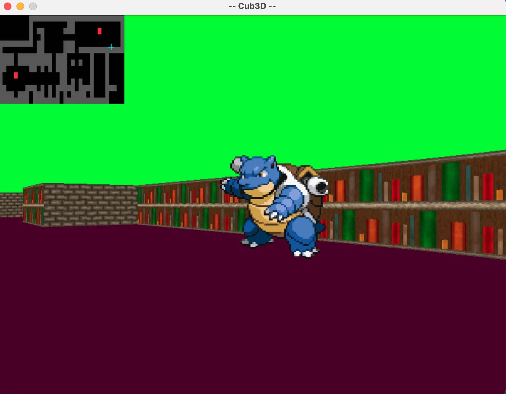

# cub3D
>Summary: This project is inspired by the world-famous eponymous 90's game, which was the first FPS ever. It will enable you to explore ray-casting. Your goal will be to make a dynamic view inside a maze, in which you'll have to find your way.

## About
  - This project utilizes raycasting in order to simulate a 3D world in 2D space. Raycasting is a very simple and efficient way to calculate the distance from the player to a wall, and this distace is then used to determine how tall the wall segment should be (shorter dist = larger wall, further dist = smaller wall).

## Building the Project - Linux
  - Navigate to your preferred directory
  - `git clone https://github.com/anthony-rk/cub3D.git cub3D && cd cub3D/cub3D-Linux && make`
  - Run the program with `./cub3D maps/map_1.cub` (replace the map path with others to view diffent maps!)

## Building the Project - MacOS
  - Navigate to your preferred directory
  - `git clone https://github.com/anthony-rk/cub3D.git cub3D && cd cub3D/cub3D-MacOS && make`
  - Run the program with `./cub3D maps/map_1.cub` (replace the map path with others to view diffent maps!)

## Controls
  - W = Move Forward
  - A = Move Backward
  - S = Move Left
  - D = Move Right
  - Left Arrow = Turn Left
  - Right Arrow = Turn Right
  - ESC = Quits the program
  - M = Toggle Minimap

